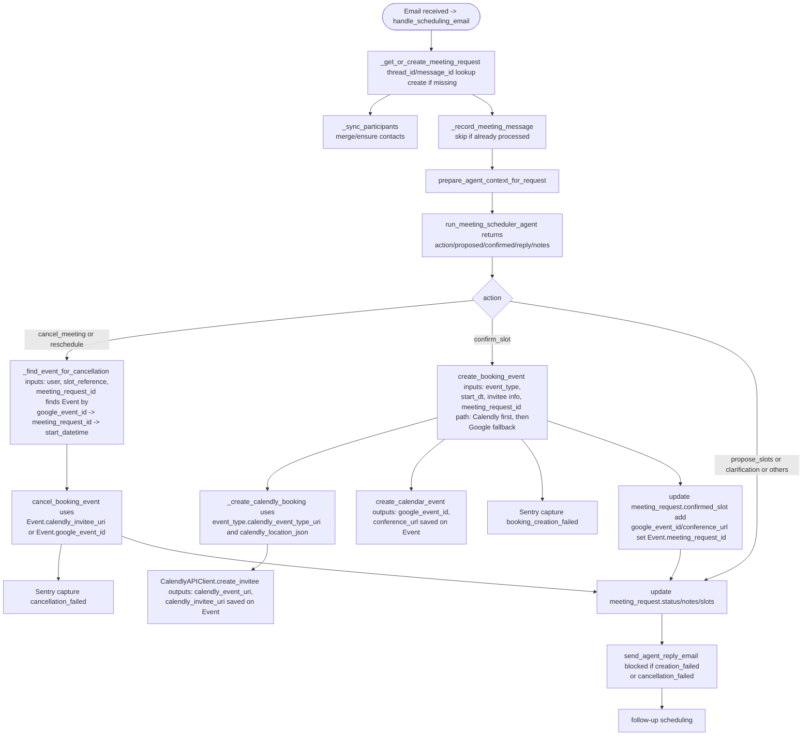

# Scheduling Agent Booking/Cancellation Flow

```mermaid
flowchart TD
  START([Email received -> handle_scheduling_email]) --> MR[_get_or_create_meeting_request \n thread_id/message_id lookup \n create if missing]
  MR --> PART[_sync_participants \n merge/ensure contacts]
  MR --> MSG[_record_meeting_message \n skip if already processed]
  MSG --> SUB1[prepare_agent_context_for_request]
  SUB1 --> AGENT[run_meeting_scheduler_agent \n returns action/proposed/confirmed/reply/notes]
  AGENT --> DECIDE{action}

  DECIDE -->|cancel_meeting or reschedule| FIND[_find_event_for_cancellation \n inputs: user, slot_reference, meeting_request_id \n finds Event by google_event_id -> meeting_request_id -> start_datetime]
  FIND --> CANCEL[cancel_booking_event \n uses Event.calendly_invitee_uri or Event.google_event_id]
  CANCEL --> SENTRY_CANCEL[Sentry capture cancellation_failed]

  DECIDE -->|confirm_slot| CREATE[create_booking_event \n inputs: event_type, start_dt, invitee info, meeting_request_id \n path: Calendly first, then Google fallback]
  CREATE --> CALBOOK[_create_calendly_booking \n uses event_type.calendly_event_type_uri and calendly_location_json]
  CALBOOK --> INV[CalendlyAPIClient.create_invitee \n outputs: calendly_event_uri, calendly_invitee_uri saved on Event]
  CREATE --> GBOOK[create_calendar_event \n outputs: google_event_id, conference_url saved on Event]
  CREATE --> SENTRY_CREATE[Sentry capture booking_creation_failed]

  CREATE --> UPDATE[update meeting_request.confirmed_slot \n add google_event_id/conference_url \n set Event.meeting_request_id]

  DECIDE -->|propose_slots or clarification or others| STATE[update meeting_request.status/notes/slots]
  CANCEL --> STATE
  UPDATE --> STATE

  STATE --> REPLY[send_agent_reply_email \n blocked if creation_failed or cancellation_failed]
  REPLY --> FU[follow-up scheduling]
```
